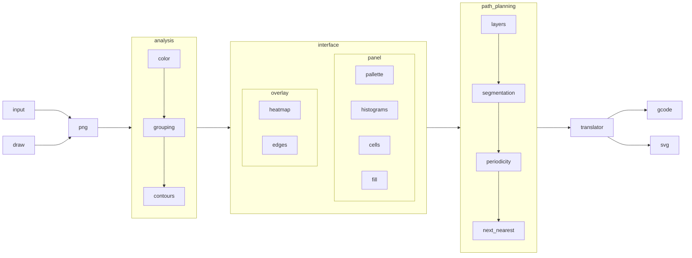

# PNG to G-Code

This is a way of processing png images into a "cell shaded" style, and then creating the gcode needed to plot the result with a 2d pen plotter.

I'm starting with images that are already close to being "cell shaded", but need cleaning. I also want to create a corresponding svg file to match the gcode that's being sent out.

## Method

