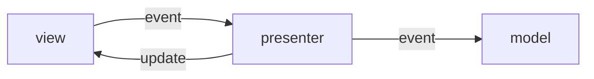
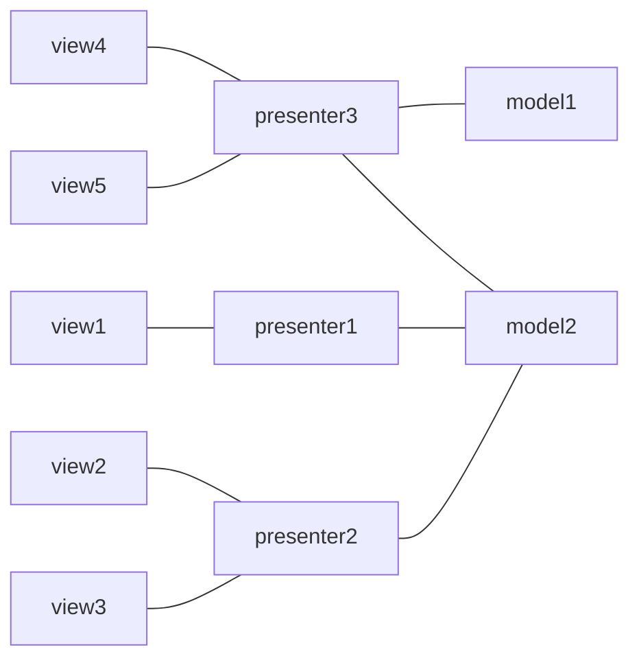
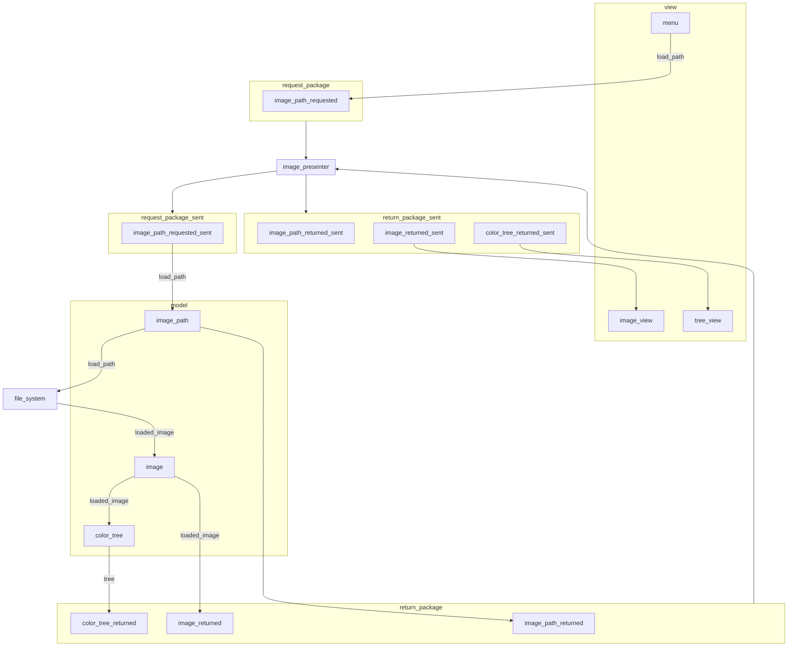
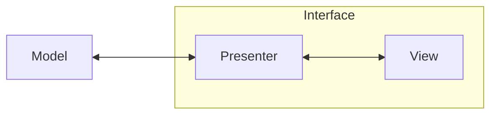

# PNG-GCode Log

## 2023-09-19

Filled out the test skeletons from yesterday. Time to actually start the development cycle I guess? It has to kind of come in pieces around life, but I already have a lot of the core functionality, so I'm hoping this UI bit is mostly a question of aesthetics rather than implementation.

### Full on Testing/Dev

- [ ] View
  - [ ] Load Button (Want to be menu instead)
    - [ ] Triggers request package send if path
    - [ ] Nothing happens if no path selected
    - [ ] stores path internally before send (for validation)
  - [ ] Handles return package correctly
    - [ ] Check returned path matches last request
    - [ ] If error, message is in valid table
    - [ ] Image valid if no error
    - [ ] Image empty if error
    - [ ] Color tree valid if no error
    - [ ] Color tree empty if error
- [ ] Request Package (View -> Presenter -> Model)
  - [ ] Image path in package
- [ ] Model
  - [ ] Request bundle triggers model update
  - [ ] Requested path stored internally
  - [ ] Image fetched or error sent back
  - [ ] Image -> color
    - [ ] Color list correct
    - [ ] Color tree correct
  - [ ] Error if color analysis fails
  - [ ] Return bundle sent
- [ ] Return Package (Model -> Presenter -> View)
  - [ ] Correct error flag for contained data
  - [ ] Error message is in valid message list
  - [ ] File path is valid if not error
  - [ ] Image is loaded if not error
    - [ ] None if error
  - [ ] Color tree is loaded if not error
    - [ ] None if error

## 2023-09-18

Going to take this one slow and steady I guess... I feel like I've learned to not waste time over-thinking things, and there's a fine line between planning well and delaying what could be productive work time.

Anyway, I do believe that "tests enable change through confidence", and I want to be better about approaching things through test based development. There's something about how plans are virtual and can be changed relatively easily, like text on a page, where actual code takes refactoring. If you have tests as well, refactoring is like having to move a building.

Anyway, planning not always bad. I like my current plans here, and while they feel drastically over-engineered, I think that is like pouring the initial slab for the house: it tells you how big you can get before you face some set of unmovable limits.

## Too much thinking, do stuff

Tests, and thus code, to implement from last time.

### Set up test skeletons for image display flow

- [ ] View
  - [x] Load Button (Want to be menu instead)
    - [x] Triggers request package send if path
    - [ ] Nothing happens if no path selected
    - [x] stores path internally before send (for validation)
  - [ ] Handles return package correctly
    - [ ] Check returned path matches last request
    - [ ] If error, message is in valid table
    - [ ] Image valid if no error
    - [ ] Image empty if error
    - [ ] Color tree valid if no error
    - [ ] Color tree empty if error
- [x] Request Package (View -> Presenter -> Model)
  - [x] Image path in package
- [ ] Model
  - [x] Request bundle triggers model update
  - [x] Requested path stored internally
  - [x] Image fetched or error sent back
  - [ ] Image -> color
    - [ ] Color list correct
    - [ ] Color tree correct
  - [x] Error if color analysis fails
  - [x] Return bundle sent
- [ ] Return Package (Model -> Presenter -> View)
  - [x] Correct error flag for contained data
  - [x] Error message is in valid message list
  - [x] File path is valid if not error
  - [x] Image is loaded if not error
    - [x] None if error
  - [x] Color tree is loaded if not error
    - [x] None if error

## 2023-09-17

Working on the interface a little more. I know how I want it to work for the most part.

- Side-by-side image and controls
- color tree with numbers for total contents at each point
- click responsiveness on the image based on toggle button
  - toggle for "merge/split"
  - click on a color and it either merges it with next closest or splits into components
- save to file

Going to start on the color tree display.

### Shit, There's no tests

I haven't made unittests yet. I had a proof of concept workflow that I took to the edge and then had to think about the actual software side of things to get colors and cells to look the way I want.

This is still early stages though, so it shouldn't be too hard to set up. I'm going to GPT is though since UI testing is very new to me.

### Ok

Ok it scales the image, though it won't bring it below its real pixel size, I'm kind of ok with that.

Test skeleton brought up. I'm not really sure I understand this "Model-Presenter-View" design entirely myself yet.

My initial understanding was this:

But in context, you may have multiple models you could use, or many views attached to a single model, each with their own presenters.

Views send in events from their users like nerves to the brain. The model is updated accordingly, and frequently the model will broadcast any changes to its registered observers.

So you can end up with wild and complicated graphs of views and presenters. Let's see if I can do that in mermaid.

Don't imagine flow so much as a fixed thing. Events flow in from the users to the models, and the models pulse out broadcasts of their changes back through the network.

### On my laptop

On second look, there are unittests, they're just for the color functionality, not for the app itself.

Ok. What functionality do I need and where should it go?

I need to tie the current color tree functionality to the interface in multiple ways.

That should all happen in the model?

### Load Image Flow

#### Flow Testing

- Menu -> Presenter
  - Stores request path internally
  - Path input packed in bundle
  - Bundle sent
- Presenter -> Model
  - Path is in request bundle
- Model
  - Request bundle triggers model update
  - Requested path stored internally
  - Image fetched or error
  - Image -> color
    - Color list correct
    - Color tree correct
  - Return bundle sent
- Model -> Presenter
  - Returned info in bundle
- Presenter -> Image View
  - Returned path matches last request
  - Image valid or error
- Presenter -> Tree View
  - Tree valid or error

## 2023-09-11

Got a basic skeleton up! None of this would be possible without GPT, or LLMs generally. There is too much to learn too quickly. The "initialization cost", "activation energy", "learning barrier", whatever you want to call it, is too high for interdisciplinary projects. You have to find an expert and run with it.

If I needed to learn every bit of Qt to be able to use it effectively, I'd have to hire someone good at Qt. Now I can do it myself. Stack overflow has been memorized. You don't need to search for an answer anymore. It's there. And in whatever language and phrasing you'd like.

This thing taught me the Model-View-Presenter paradigm as well as the the "observer-presenter" pattern in a day on the fly because it was applicable.

## 2023-09-10

### Front End Thoughts

Need to start on the front end. I have the color tree, and most of the functionality there, but I'm working blind. I can't see the images I'm analyzing, and I won't be able to see the results of any changes very easily if I just have to look at pngs in post.

It's time for a real-time display. Qt is always my goto. Just because it's Paul's favorite, and I love and trust him. Plus my current work uses it, and they have been the cleanest, most conscious coders I have met.

#### Slow Down for Quality's Sake

With that said, I think I need to slow down enough to focus on quality more than speed. I've been concerned with how little time I had, that I've been spending it like it's the end of the world. I need to spend it like the end of the world is in the future. It is a thing to be prepared for, but I cannot yet be at YOLO levels of disregard.

### Model-View-Presenter

After a bit of GPT, I think the model-view-presenter paradigm is the one I'm going to use based on it's ability to be test driven.

I am unfamiliar with most of these paradigms, since I kind of scratch my life together as I go. Here's my quick attempt:

- Model: the backend
- View: the frontend
- Presenter: the go-between

I'm writing a file called `interface.py` that will manage the view and presenter. I may have to split it into two files later for each class, but it seems like the model is basically what I already have, and the rest is what I'm aiming for.

### Building It Out

- image loader? (pil)
- color tree
- contouring

## 2023-09-09

Trying to reaclimate without a log. I think I had the color tree done last time, and now I need to work on converting the image accordingly.
