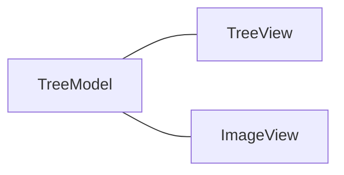
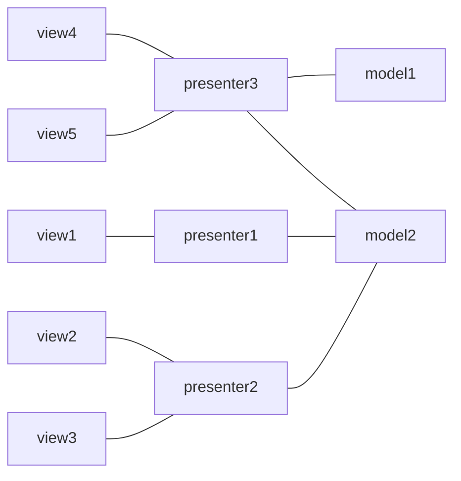
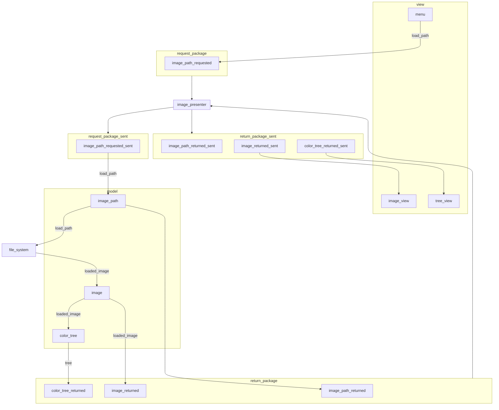
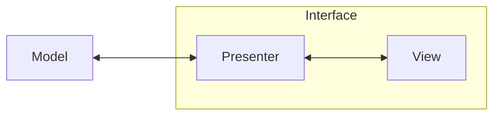

# PNG-GCode Log

## 2023-10-02

I can't seem to let this octree thing go. I have an idea where you have multiple copies for the points near the divides. One for each neighboring octant. That way you can always be assured that all points within the whole space are part of at least one neighborhood containing their nearest neighbor.

This is not guaranteed in a normal octree, and while searching for a nearest neighbor to a point is faster, searching for the closest 2 points is still hard. With that change it may be more possible.

That or I maintain a overlapping octrees like a mathematical "covering", with the trees overlayed to cover each other's boundaries. This again gives a neighborhood for every "nearest neighbor".

## 2023-09-29

I've been beating my head against this one for a while. I think I'm done for a bit. Going to go back to monotext display and the spellbook.

I really want this to get done, and the octree is super interesting, but I'm not seeing a lot of little results that are giving me the boost I need. I'm switching projects for now as something else has grown more interesting by absence.

>Maybe I should pay attentions to that. I need small achievable goals I can show off that will make me feel good.
>It's silly, but I need the energy to be enthusiastic about a project, and that generally comes from novelty, but it gets stale as the results never seem to materialize quickly.

One more small push on the siblings/neighbors functions in the octree.

I'm not hopeful I'm going to have this done in time to make things for the holiday faire. Even if I get the cell-shading software finished, I still have to make the contour finding, and path planning algorithms. Not to mention shading/crosshatching if I want anything other than flat images.

## 2023-09-27

Got octree working and sufficiently tested for what I need... I think.

Now I need to figure out how to use an octree for an $O(n \log n)$ nearest neighbor search.

And just to think about some math for a sec:

## How efficient is this really?

I need to group a set of 3d points by pairs in terms of distance. That is to say the nearest 2 groups get merged at each stage.

How do I most efficiently find the nearest 2 groups? Isn't that taking all unique pairs of $n$ points (of which there are $(n-1)*n/2$ making it $O(n^2)$ ), computing distances for each, and then sorting for merge order?

Distances cost $O(n)$, and sorting is most often $O(n \log n)$.

Isn't getting distances for *all* unique pairs the limiting factor? One a group is merged, many of the distances to other points that have also been grouped never get used.

Can this process be optimized by "lazily" computing the distances that are needed on-the-fly?

### Agglomerate with octree?

Use a distance matrix, but don't fully fill it in?

How do you find the two nearest points in an octree?
If I keep two octrees with offset split values, does that help? That is, if two points are not in the same cluster for at least one octree, do we know they must be at least a certain distance away each other?

## 2023-09-24

Ok, getting cut off at 7am is kind of par for the course. I get from when I wake up at 5ish until the kids wake up at 7 to do anything.

Working on integrating the tree model into the interface model.

The QTreeView structure seems to take a [QModelIndex](https://doc.qt.io/qtforpython-6/PySide6/QtCore/QModelIndex.html)

### Grok

Ok. I've taken the time to read through the code GPT spit out and comment it up. I think I understand it.

Integrating the color tree on the other hand is really just redoing what I've already done. Unfortunately, the algorithm is garbage, and I don't want to have to ad QWhatever to the whole thing all over again and make sure nothing breaks.

This is the time to re-design a better algorithm using kd trees or an oct-tree to be more optimized.

### Redesign

We want to group points starting with nearest neighbors. The distance between groups is the minimum distance between the points in them.

But if we start with the list of points, and ignore order, then compute distance between all of them, that takes $((n^2 - n) / 2) + n$ comparison.

$$
(n^2 - n) / 2 = n(n-1) / 2
$$

$$
((n^2 - n) / 2) + n \\
= (n^2 - n + 2n) / 2 \\
= (n^2 + n) / 2 \\
= n(n + 1) / 2
$$

Notice that $n(n-1)/2$ is always an integer, as is $n(n+1)$, since one of each pair must be even if $n$ is an integer.

>This is an application of the pigeon-hole principle on a partition of the integers into equivalence classes based on a modulus of two. Ie, you split the integers into groups of two, and for each group you call one "even" and one "odd". This could have been done in groups of 3, 4, or 5, using any names for the members of the group. But prime numbers are useful, and two is the smallest, making it the first instinct and easiest to use.
>$(n(n+1)(n+2)/3)$ is an integer for instance, because one of $n$, $(n+1)$, and $(n+2)$ must be a multiple of 3.
>
>This all makes me wonder why we define multiplying by one's self as "squaring" a number, and not by one's successor; even in exponentiation more generally.
>
>Each of these produce larger integers that seem to somehow "contain the information from the product". Why multiply by one's self, and not by one's successor and then halve? It is a well defined, invertible(?), closed operation on the integers, and seems to somehow contain only the "essential" bits from the combination... if you don't care about order. =P

$n(n+1)/2$ operations to compute orderless pairwise distances in a set of size $n$, making it an $O(n^2)$ process.

Apparently there is an $O(n \log n)$ way of finding the closest pairs in a set by using a KD tree, or an octree, to sort and index the points before grouping. Thus, if the merge can also be done in less than $O(n \log n)$ time, we can make this a more reasonable process than $O(n^2)$ for large collections of colors/points.

>Is there a linear algorithm using like a hash-table strategy or something?
>>Can I do two levels of commenting? ...Cool, it renders. =)

### New Process

Octree: separates 3d space with 3 axis-aligned planes into 8 octants

We need to start with the color list, split into octants, and then repeat to sort.

>Two of these with different "phased" splits on the octants may make it easier to search for the minimum between two groups, while only doubling the compute time, and therefore not increasing the order of the process. Not sure how this might work, I just like the idea.

### Octree Sort

```pseudo
for each point:
  decide what octant it's in,
  and assign it accordingly

for each octant:
  rerun the split and sort
  with the octant as the full space
```

I think this is the right idea, but I also know that recursion can be bad, and it's better to use a localized implementation with a for loop if possible. How is that possible in this case? How can I remove the recursion, while retaining the functionality?

Let's ask GPT

#### GPT on Removing Recursion

You can replace recursion with an explicit stack to manage the octants that need to be processed. Here's a rough outline in pseudo-code:

```pseudo
Initialize stack with the root octant
while stack is not empty:
  current_octant = stack.pop()
  
  split current_octant into 8 sub-octants
  
  for each point in current_octant:
    decide what sub-octant it's in,
    and assign it accordingly
  
  for each non-empty sub-octant:
    stack.push(sub-octant)
```

This way, you're manually managing what would be the call stack in a recursive approach.
Critique

This approach may require additional memory for the stack and the management of octants, but it avoids the pitfalls of recursion, such as stack overflow.

#### Not Bad

Not bad advice.

```pseudo
Make a stack of octants to sort.

At each level,
  sort all points into their respective octants,
  then push all octants with their points onto the stack.

  pop out the next octant in the stack and repeat
```

A first in-first out (FIFO) structure (like a "stack") makes this a "depth first sort". If you instead used a first in-last out structure like a queue, you would be doing the equivalent of a "breadth first sort".

I also looked into using Test Driven Development, but I'm beginning to wonder how useful it really is. Do tests really enable change? It feels like it makes things harder.

## 2023-09-23

Ok. Left off very abruptly yesterday. Working on integrating the nested color tree with a TreeModel that's compatible with the [QTreeView](https://doc.qt.io/qtforpython-5/PySide2/QtWidgets/QTreeView.html).

There is a [QTreeWidget](https://doc.qt.io/qtforpython-5/PySide2/QtWidgets/QTreeWidget.html) apparently, but it is a simplified version that contains the view and the model together, and apparently may not work well for large or complicated trees.

So. Need to make a model that overwrites the correct functions to extend [QAbstractItemModel](https://doc.qt.io/qtforpython-5/PySide2/QtCore/QAbstractItemModel.html) apparently.

Then I take 

## 2023-09-22

Really trying to get this thing working. If I can just get a nice set of flat-colored cell coming out, contour mapping will look **much** nicer.

Here's how I currently want things to end up:



## 2023-09-19

Filled out the test skeletons from yesterday. Time to actually start the development cycle I guess? It has to kind of come in pieces around life, but I already have a lot of the core functionality, so I'm hoping this UI bit is mostly a question of aesthetics rather than implementation.

### Full on Testing/Dev

- [ ] View
  - [ ] Load Button (Want to be menu instead)
    - [ ] Triggers request package send if path
    - [ ] Nothing happens if no path selected
    - [ ] stores path internally before send (for validation)
  - [ ] Handles return package correctly
    - [ ] Check returned path matches last request
    - [ ] If error, message is in valid table
    - [ ] Image valid if no error
    - [ ] Image empty if error
    - [ ] Color tree valid if no error
    - [ ] Color tree empty if error
- [ ] Request Package (View -> Presenter -> Model)
  - [ ] Image path in package
- [ ] Model
  - [ ] Request bundle triggers model update
  - [ ] Requested path stored internally
  - [ ] Image fetched or error sent back
  - [ ] Image -> color
    - [ ] Color list correct
    - [ ] Color tree correct
  - [ ] Error if color analysis fails
  - [ ] Return bundle sent
- [ ] Return Package (Model -> Presenter -> View)
  - [ ] Correct error flag for contained data
  - [ ] Error message is in valid message list
  - [ ] File path is valid if not error
  - [ ] Image is loaded if not error
    - [ ] None if error
  - [ ] Color tree is loaded if not error
    - [ ] None if error

## 2023-09-18

Going to take this one slow and steady I guess... I feel like I've learned to not waste time over-thinking things, and there's a fine line between planning well and delaying what could be productive work time.

Anyway, I do believe that "tests enable change through confidence", and I want to be better about approaching things through test based development. There's something about how plans are virtual and can be changed relatively easily, like text on a page, where actual code takes refactoring. If you have tests as well, refactoring is like having to move a building.

Anyway, planning not always bad. I like my current plans here, and while they feel drastically over-engineered, I think that is like pouring the initial slab for the house: it tells you how big you can get before you face some set of unmovable limits.

## Too much thinking, do stuff

Tests, and thus code, to implement from last time.

### Set up test skeletons for image display flow

- [ ] View
  - [x] Load Button (Want to be menu instead)
    - [x] Triggers request package send if path
    - [ ] Nothing happens if no path selected
    - [x] stores path internally before send (for validation)
  - [ ] Handles return package correctly
    - [ ] Check returned path matches last request
    - [ ] If error, message is in valid table
    - [ ] Image valid if no error
    - [ ] Image empty if error
    - [ ] Color tree valid if no error
    - [ ] Color tree empty if error
- [x] Request Package (View -> Presenter -> Model)
  - [x] Image path in package
- [ ] Model
  - [x] Request bundle triggers model update
  - [x] Requested path stored internally
  - [x] Image fetched or error sent back
  - [ ] Image -> color
    - [ ] Color list correct
    - [ ] Color tree correct
  - [x] Error if color analysis fails
  - [x] Return bundle sent
- [ ] Return Package (Model -> Presenter -> View)
  - [x] Correct error flag for contained data
  - [x] Error message is in valid message list
  - [x] File path is valid if not error
  - [x] Image is loaded if not error
    - [x] None if error
  - [x] Color tree is loaded if not error
    - [x] None if error

## 2023-09-17

Working on the interface a little more. I know how I want it to work for the most part.

- Side-by-side image and controls
- color tree with numbers for total contents at each point
- click responsiveness on the image based on toggle button
  - toggle for "merge/split"
  - click on a color and it either merges it with next closest or splits into components
- save to file

Going to start on the color tree display.

### Shit, There's no tests

I haven't made unittests yet. I had a proof of concept workflow that I took to the edge and then had to think about the actual software side of things to get colors and cells to look the way I want.

This is still early stages though, so it shouldn't be too hard to set up. I'm going to GPT is though since UI testing is very new to me.

### Ok

Ok it scales the image, though it won't bring it below its real pixel size, I'm kind of ok with that.

Test skeleton brought up. I'm not really sure I understand this "Model-Presenter-View" design entirely myself yet.

My initial understanding was this:


But in context, you may have multiple models you could use, or many views attached to a single model, each with their own presenters.

Views send in events from their users like nerves to the brain. The model is updated accordingly, and frequently the model will broadcast any changes to its registered observers.

So you can end up with wild and complicated graphs of views and presenters. Let's see if I can do that in mermaid.



Don't imagine flow so much as a fixed thing. Events flow in from the users to the models, and the models pulse out broadcasts of their changes back through the network.

### On my laptop

On second look, there are unittests, they're just for the color functionality, not for the app itself.

Ok. What functionality do I need and where should it go?

I need to tie the current color tree functionality to the interface in multiple ways.

That should all happen in the model?

### Load Image Flow



#### Flow Testing

- Menu -> Presenter
  - Stores request path internally
  - Path input packed in bundle
  - Bundle sent
- Presenter -> Model
  - Path is in request bundle
- Model
  - Request bundle triggers model update
  - Requested path stored internally
  - Image fetched or error
  - Image -> color
    - Color list correct
    - Color tree correct
  - Return bundle sent
- Model -> Presenter
  - Returned info in bundle
- Presenter -> Image View
  - Returned path matches last request
  - Image valid or error
- Presenter -> Tree View
  - Tree valid or error

## 2023-09-11

Got a basic skeleton up! None of this would be possible without GPT, or LLMs generally. There is too much to learn too quickly. The "initialization cost", "activation energy", "learning barrier", whatever you want to call it, is too high for interdisciplinary projects. You have to find an expert and run with it.

If I needed to learn every bit of Qt to be able to use it effectively, I'd have to hire someone good at Qt. Now I can do it myself. Stack overflow has been memorized. You don't need to search for an answer anymore. It's there. And in whatever language and phrasing you'd like.

This thing taught me the Model-View-Presenter paradigm as well as the the "observer-presenter" pattern in a day on the fly because it was applicable.

## 2023-09-10

### Front End Thoughts

Need to start on the front end. I have the color tree, and most of the functionality there, but I'm working blind. I can't see the images I'm analyzing, and I won't be able to see the results of any changes very easily if I just have to look at pngs in post.

It's time for a real-time display. Qt is always my goto. Just because it's Paul's favorite, and I love and trust him. Plus my current work uses it, and they have been the cleanest, most conscious coders I have met.

#### Slow Down for Quality's Sake

With that said, I think I need to slow down enough to focus on quality more than speed. I've been concerned with how little time I had, that I've been spending it like it's the end of the world. I need to spend it like the end of the world is in the future. It is a thing to be prepared for, but I cannot yet be at YOLO levels of disregard.

### Model-View-Presenter

After a bit of GPT, I think the model-view-presenter paradigm is the one I'm going to use based on it's ability to be test driven.

I am unfamiliar with most of these paradigms, since I kind of scratch my life together as I go. Here's my quick attempt:

- Model: the backend
- View: the frontend
- Presenter: the go-between

I'm writing a file called `interface.py` that will manage the view and presenter. I may have to split it into two files later for each class, but it seems like the model is basically what I already have, and the rest is what I'm aiming for.



### Building It Out

- image loader? (pil)
- color tree
- contouring

## 2023-09-09

Trying to reaclimate without a log. I think I had the color tree done last time, and now I need to work on converting the image accordingly.
