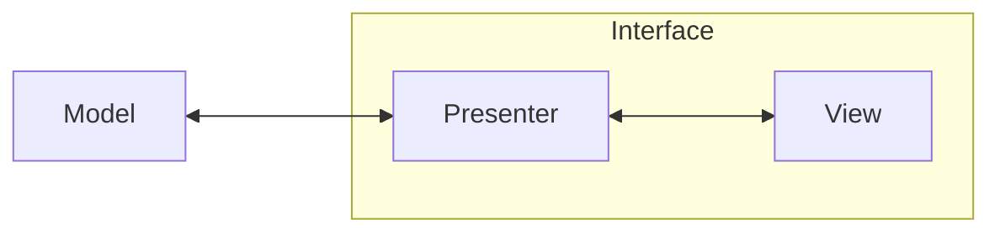

# PNG-GCode Log

## 2023-09-11

Got a basic skeleton up! None of this would be possible without GPT, or LLMs generally. There is too much to learn too quickly. The "initialization cost", "activation energy", "learning barrier", whatever you want to call it, is too high for interdisciplinary projects. You have to find an expert and run with it.

If I needed to learn every bit of Qt to be able to use it effectively, I'd have to hire someone good at Qt. Now I can do it myself. Stack overflow has been memorized. You don't need to search for an answer anymore. It's there. And in whatever language and phrasing you'd like.

This thing taught me the Model-View-Presenter paradigm as well as the the "observer-presenter" pattern in a day on the fly because it was applicable.

## 2023-09-10

### Front End Thoughts

Need to start on the front end. I have the color tree, and most of the functionality there, but I'm working blind. I can't see the images I'm analyzing, and I won't be able to see the results of any changes very easily if I just have to look at pngs in post.

It's time for a real-time display. Qt is always my goto. Just because it's Paul's favorite, and I love and trust him. Plus my current work uses it, and they have been the cleanest, most conscious coders I have met.

#### Slow Down for Quality's Sake

With that said, I think I need to slow down enough to focus on quality more than speed. I've been concerned with how little time I had, that I've been spending it like it's the end of the world. I need to spend it like the end of the world is in the future. It is a thing to be prepared for, but I cannot yet be at YOLO levels of disregard.

### Model-View-Presenter

After a bit of GPT, I think the model-view-presenter paradigm is the one I'm going to use based on it's ability to be test driven.

I am unfamiliar with most of these paradigms, since I kind of scratch my life together as I go. Here's my quick attempt:

- Model: the backend
- View: the frontend
- Presenter: the go-between

I'm writing a file called `interface.py` that will manage the view and presenter. I may have to split it into two files later for each class, but it seems like the model is basically what I already have, and the rest is what I'm aiming for.

### Building It Out

- image loader? (pil)
- color tree
- contouring

## 2023-09-09

Trying to reaclimate without a log. I think I had the color tree done last time, and now I need to work on converting the image accordingly.
