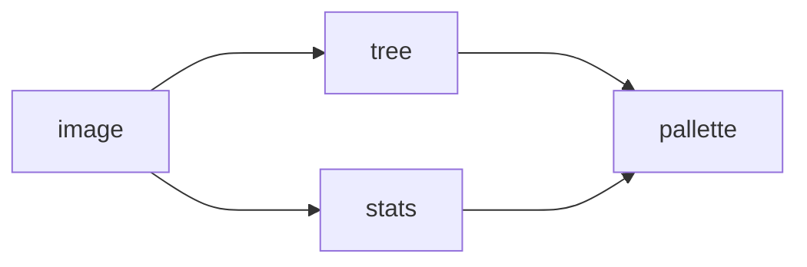

# Color

The point of "cell shading" to some extent is to reduce a picture down into a collection of flat tone "cells" that are regions of a single color in the image.

## References

- [SciPy Hierarchical Clustering](cluster)

[cluster]: https://docs.scipy.org/doc/scipy/reference/cluster.hierarchy.html#module-scipy.cluster.hierarchy